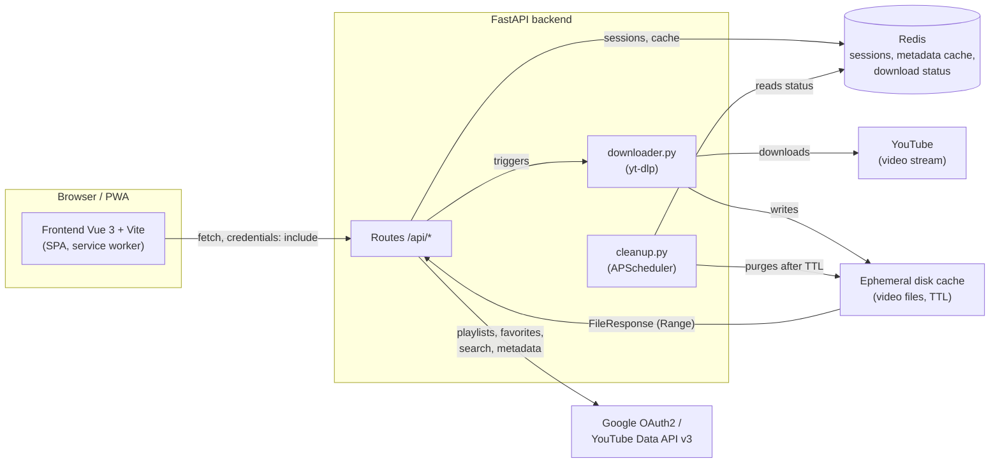
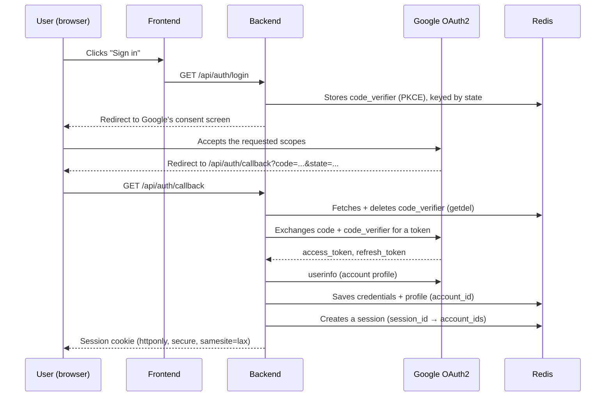
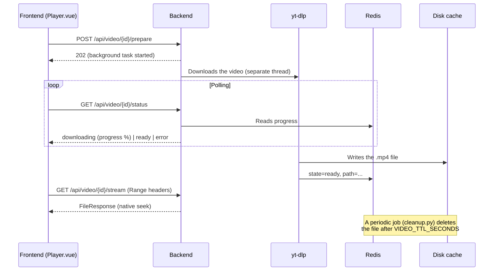

# OuyouyouTube

[](https://github.com/wardensfx/OuyouyouTube/actions/workflows/ci.yml)
[](LICENSE)

A personal YouTube client: a PWA that reproduces the official app's
experience (playlists, favorites, subscriptions, search, home feed), but
playback is streamed from your own backend. That backend downloads the
video via [yt-dlp](https://github.com/yt-dlp/yt-dlp), serves it with seek
support, then deletes it automatically after a configurable delay. **No
video is stored durably.**

## ⚠️ Legal disclaimer

This project is a tool meant for **strictly personal use**, designed to
browse *your own* YouTube account (playlists, subscriptions, favorites)
through the official API. Downloading the video stream goes through
yt-dlp, which circumvents YouTube's delivery protections — this may
violate [YouTube's Terms of Service](https://www.youtube.com/t/terms)
depending on your jurisdiction and how you use it.

- No video is stored durably: every file is deleted after a short delay
  (30 minutes by default) — the architecture doesn't provide for any
  public hosting or redistribution.
- This repository contains code only: no copyrighted content is
  distributed here.
- The author and contributors of this project cannot be held liable for
  any use that would violate YouTube's Terms of Service or applicable
  law. **It's up to you to verify that your usage complies with the laws
  of your jurisdiction before deploying and using this tool.**
- This project is not affiliated with Google/YouTube in any way.

## Features

- Google OAuth2 login, **multi-account** (several Google accounts linked to
  a single session)
- Playlists: create, rename, delete, add/remove videos, customizable
  ordering
- Favorites (liked videos), subscriptions, trending, search
- Channel pages, clickable channel names everywhere
- Automatic resume playback, watched/unwatched status, progress history
- Dark glassmorphism theme, responsive, installable PWA (mobile/desktop),
  pull-to-refresh on mobile
- YouTube-style keyboard shortcuts in the player

See [`ROADMAP.md`](ROADMAP.md) for the detail of what's done, in progress,
or deliberately out of scope.

## Architecture



Guiding principle: **as little custom code as possible**. Every
cross-cutting concern is delegated to a standard library rather than
reimplemented:

| Need | Solution |
| --- | --- |
| Video seek (`Range` headers) | Starlette's `FileResponse` — native |
| Google OAuth2 | `google-auth-oauthlib` (official library) |
| Periodic file cleanup | `APScheduler` |
| Metadata / session cache | Redis |

## How it works

### Authentication (OAuth2 + PKCE)



The session cookie only holds an opaque `session_id` — Google's tokens
(access/refresh) stay in Redis, never on the client.

### Watching a video



## Stack

| Layer | Tech | Why |
| --- | --- | --- |
| Backend | [FastAPI](https://fastapi.tiangolo.com/) | Imports `yt_dlp` directly as a Python lib (no subprocess) |
| Video extraction | [yt-dlp](https://github.com/yt-dlp/yt-dlp) | The only component that circumvents YouTube's protections |
| YouTube data | [YouTube Data API v3](https://developers.google.com/youtube/v3) via `google-api-python-client` | Playlists/favorites/metadata — never via yt-dlp |
| Auth | `google-auth-oauthlib` | OAuth2 + PKCE, official Google library |
| Cache / sessions | [Redis](https://redis.io/) | Metadata (15 min TTL), sessions, download status |
| File cleanup | [APScheduler](https://apscheduler.readthedocs.io/) | Periodic job, purges after TTL |
| Frontend | [Vue 3](https://vuejs.org/) + [Vite](https://vitejs.dev/) | Reactive SPA |
| State | [Pinia](https://pinia.vuejs.org/) | Shared store (library, progress, playlists) |
| Routing | [vue-router](https://router.vuejs.org/) | SPA navigation |
| PWA | [vite-plugin-pwa](https://vite-pwa-org.netlify.app/) | Manifest + service worker, installable |
| Icons | [lucide](https://lucide.dev/) | UI icon set |
| Reverse proxy (prod) | [Caddy](https://caddyserver.com/) or [Traefik](https://traefik.io/) | Automatic HTTPS (Let's Encrypt) |

## Quick start

### Prerequisites
- Python 3.11+
- Node 18+
- Redis (`redis-server`)
- A Google Cloud project with the "YouTube Data API v3" enabled and OAuth
  2.0 credentials (type "Web application") — see the detailed walkthrough
  below.

### Set up Google Cloud (one-time)

The app needs its own OAuth credentials to access *your* YouTube account.
This is configured entirely from the
[Google Cloud console](https://console.cloud.google.com/), free of charge.

1. **Create a project** — project selector at the top of the console →
   **New project** → any name (e.g. `ouyouyoutube`).
2. **Enable the YouTube Data API v3** — menu **APIs & Services →
   Library** → search **YouTube Data API v3** → **Enable**.
3. **Configure the OAuth consent screen** — **APIs & Services → OAuth
   consent screen**:
   - User type: **External** (a personal Gmail account can't create an
     "internal" app).
   - Fill in an app name, a support email, and a developer email.
   - **Scopes** section: explicitly add the 4 scopes used by the app
     (`server/app/auth.py`):
     - `https://www.googleapis.com/auth/youtube`
     - `openid`
     - `https://www.googleapis.com/auth/userinfo.email`
     - `https://www.googleapis.com/auth/userinfo.profile`

     ⚠️ A scope not explicitly declared here is silently dropped from the
     token response by Google, with no visible error — see `ROADMAP.md`
     (the "Known constraints" section).
   - **Test users** section: until the app is published/verified by
     Google, only accounts added here can sign in — add your own Gmail
     address.
4. **Create the OAuth 2.0 credentials** — **APIs & Services → Credentials
   → Create credentials → OAuth client ID**:
   - Application type: **Web application**.
   - **Authorized redirect URIs**: must match `GOOGLE_REDIRECT_URI` in
     `server/.env` *exactly* (see below). Locally with the default
     values:
     ```
     http://localhost:8000/api/auth/callback
     ```
   - Save, then grab the **Client ID** and **Client Secret** shown.
5. **Fill in `server/.env`** (see the next section to create it):
   ```
   GOOGLE_CLIENT_ID=xxxxxxxxxx.apps.googleusercontent.com
   GOOGLE_CLIENT_SECRET=xxxxxxxxxx
   GOOGLE_REDIRECT_URI=http://localhost:8000/api/auth/callback
   ```

When deploying (real domain behind Caddy/Traefik), replace the redirect
URI with `https://your-domain/api/auth/callback` — both in Google Cloud
Console **and** in `GOOGLE_REDIRECT_URI`/`FRONTEND_ORIGIN` (see the
[Deployment](#deployment-prod) section). Google rejects `.local` (mDNS)
domains: you can't test with `http://xxx.local`, you need `localhost` or a
real domain.

### Backend + Redis in a container (recommended, especially on Windows)

Redis has no official Windows build, and running the backend in a
container avoids having to manage a Python venv by hand. The
`docker-compose.yml` at the repo root starts Redis + backend, with
hot-reload:

```powershell
# Windows: Docker runs inside a WSL distro (e.g. Ubuntu)
wsl -d Ubuntu -- bash -c "cd /mnt/c/path/to/OuyouyouTube && docker compose --profile dev up --watch"
```

```bash
# macOS/Linux with Docker installed natively
docker compose --profile dev up --watch
```

`--profile dev` is required: `backend` (dev) and `backend-prod` are two
separate profiled services, so the "dev" backend (port 8000 published,
hot-reload) never runs at the same time as the `prod` profile (which
should only expose Caddy — see below).

`--watch` live-syncs `server/app/` into the container (code changes
trigger uvicorn's reload) and rebuilds the image automatically if
`requirements.txt` changes. The backend is exposed on
`http://localhost:8000` just like a plain local run.

Before the first run: `cp server/.env.example server/.env` and fill in
`GOOGLE_CLIENT_ID` / `GOOGLE_CLIENT_SECRET`.

### Frontend (always run directly, outside the container)

```bash
cd front
npm install
npm run dev
```

Open http://localhost:5173 — the Vite proxy forwards everything under
`/api/*` to the backend on port 8000 (all API routes live under that
prefix, precisely so they never collide with frontend routes, e.g.
`/search` or `/playlists/manage`).

### Backend directly (without Docker)

```bash
cd server
python3 -m venv .venv && source .venv/bin/activate   # Windows: python -m venv .venv then .\.venv\Scripts\python.exe
pip install -r requirements.txt
cp .env.example .env   # fill in GOOGLE_CLIENT_ID / SECRET
redis-server &          # or just the Redis container if there's no native build (Windows)
uvicorn app.main:app --reload --port 8000
```

**IPv4/IPv6 pitfall (Windows)**: on some setups, `localhost` resolves to
`::1` (IPv6) first. If the backend only listens on `127.0.0.1` (IPv4), the
Vite proxy returns `502 Bad Gateway`. `front/vite.config.js` therefore
points explicitly to `http://127.0.0.1:8000` (not `localhost`).

**OAuth over local HTTP**: `oauthlib` refuses the token exchange over
non-HTTPS by default. In dev, with a `redirect_uri` on `http://localhost`,
you need to set `OAUTHLIB_INSECURE_TRANSPORT=1` in the backend's
environment (already done in `docker-compose.yml`; set it yourself if you
run uvicorn without Docker). **Never do this in production.**

**Scope widened after the fact**: `flow.authorization_url(..., include_granted_scopes="true")`
returns, in addition to the scopes requested in the current request, every
scope already granted to the app in the past (Google's incremental auth —
useful to avoid re-prompting consent every time a scope is added).
`oauthlib` treats any mismatch with what was requested as an error by
default, including an *extra* scope. Requires
`OAUTHLIB_RELAX_TOKEN_SCOPE=1` in the backend's environment (already done
in `docker-compose.yml` and the Podman quadlets) — unlike
`OAUTHLIB_INSECURE_TRANSPORT`, this one is also needed in production, not
just dev.

## Tests

```bash
# Backend
cd server && source .venv/bin/activate
pip install -r requirements-dev.txt
pytest -v

# Frontend
cd front
npm run test
```

CI (`.github/workflows/ci.yml`) runs both suites plus `npm run build` on
every push/PR. See [`ROADMAP.md`](ROADMAP.md) for what's covered.

## Deployment (prod)

The `frontend` service in `docker-compose.yml` (`prod` profile) builds the
SPA and serves it via **Caddy** (`front/Dockerfile`, `front/Caddyfile`),
which also acts as a reverse proxy to the backend for everything under
`/api/*`. A single entry point, automatic HTTPS (Let's Encrypt) if
`SITE_ADDRESS` is a real domain name — `backend-prod` (also `prod`
profile) doesn't publish any port on the host, only `frontend` is
reachable from the outside, same as in the Podman quadlets.

```bash
cp .env.example .env   # set SITE_ADDRESS
docker compose --profile prod up -d --build
```

Caddy listens on 8080 (HTTP) / 8443 (HTTPS), published as-is on the host.

- `SITE_ADDRESS=:8080` (default) → plain HTTP, handy for testing locally
  without a domain (no TLS).
- `SITE_ADDRESS=ouyouyoutube.yourdomain.com` → Caddy obtains a Let's
  Encrypt certificate automatically on 8443 (DNS must point to the host;
  redirect the external ports 80/443 to 8080/8443 on this machine if
  needed, e.g. on your router/box).

In every case, `server/.env` (`GOOGLE_REDIRECT_URI`, `FRONTEND_ORIGIN`)
must be consistent with `SITE_ADDRESS` — and the `redirect_uri` declared
in Google Cloud Console must match exactly. Google rejects `.local` (mDNS)
domains: you can't test the OAuth login via `http://xxx.local`, you need a
real domain (or `localhost`).

### Alternative: Podman Quadlet (behind an existing Traefik + pod_utils)

`services/*.container` provides an equivalent of `docker-compose.yml`
(`prod` profile) as systemd Quadlet units, aligned with the other services
on the same host (`server_gateway` network, `pod_utils` pod, same Traefik
label style): none of these containers publish any port, they join
`pod_utils` and attach to `server_gateway` like the other apps. The
frontend is protected by the `authentik` middleware on top of the Google
login; `backend` and `redis` stay internal (no Traefik label).

⚠️ `pod_utils` shares the network namespace across all its members: check
that no other service in the pod already uses ports 6379 (redis), 8000
(backend), 8080/8443 (frontend) before enabling these units.

Adjust as needed:
- `EnvironmentFile=%h/ouyouyoutube/server.env` (backend) → copy
  `server/.env` to that location on the host.
- The domain (`ouyouyoutube.d-yann.fr`) in
  `ouyouyoutube_frontend.container` if you use a different one.

```bash
podman build -t ouyouyoutube_backend:latest ./server
podman build -t ouyouyoutube_frontend:latest ./front

mkdir -p ~/.config/containers/systemd
cp services/*.container ~/.config/containers/systemd/
systemctl --user daemon-reload
systemctl --user enable --now ouyouyoutube_redis.service ouyouyoutube_backend.service ouyouyoutube_frontend.service
```

## Notes

- yt-dlp is imported as a Python lib, not run as a subprocess — simpler to
  maintain. It stays isolated in `server/app/downloader.py`, never called
  anywhere else in the code.
- Seek works natively thanks to Starlette's `FileResponse` — no custom
  Range handling code.
- If YouTube throttles/blocks requests: export a `cookies.txt` (browser
  extension such as "Get cookies.txt") and set `YTDLP_COOKIES_FILE` in
  `.env`.

## Contributing

Contributions are welcome — see [`CONTRIBUTING.md`](CONTRIBUTING.md) for
the dev setup, branch/commit conventions, and PR process. This project
follows the [Contributor Covenant](CODE_OF_CONDUCT.md).

To report a security vulnerability, see [`SECURITY.md`](SECURITY.md)
instead of opening a public issue.

## Credits

This project relies entirely on open source libraries. A huge thanks to
their authors and maintainers:

**Backend**
- [yt-dlp](https://github.com/yt-dlp/yt-dlp) (Unlicense) — video stream extraction/download
- [FastAPI](https://github.com/fastapi/fastapi) (MIT) — backend framework
- [Uvicorn](https://github.com/encode/uvicorn) (BSD-3-Clause) — ASGI server
- [google-api-python-client](https://github.com/googleapis/google-api-python-client) (Apache-2.0) — YouTube Data API v3 client
- [google-auth-oauthlib](https://github.com/googleapis/google-auth-library-python-oauthlib) (Apache-2.0) — OAuth2 + PKCE flow
- [redis-py](https://github.com/redis/redis-py) (MIT) — async Redis client
- [APScheduler](https://github.com/agronholm/apscheduler) (MIT) — periodic cleanup job
- [Pydantic](https://github.com/pydantic/pydantic) / [pydantic-settings](https://github.com/pydantic/pydantic-settings) (MIT) — validation and configuration

**Frontend**
- [Vue.js](https://github.com/vuejs/core) (MIT) — UI framework
- [Vite](https://github.com/vitejs/vite) (MIT) — build tool
- [Pinia](https://github.com/vuejs/pinia) (MIT) — state management
- [vue-router](https://github.com/vuejs/router) (MIT) — SPA routing
- [vite-plugin-pwa](https://github.com/vite-pwa/vite-plugin-pwa) (MIT) — manifest + service worker
- [Lucide](https://github.com/lucide-icons/lucide) (ISC) — icons
- [Vitest](https://github.com/vitest-dev/vitest) (MIT) — tests

**Infrastructure (deployment)**
- [Redis](https://github.com/redis/redis) (RSALv2/SSPLv1 dual license depending on version — see the official repo)
- [Caddy](https://github.com/caddyserver/caddy) (Apache-2.0) — reverse proxy, automatic HTTPS
- [Traefik](https://github.com/traefik/traefik) (MIT) — alternative reverse proxy (Podman Quadlet deployment)

This project itself is not affiliated with, or endorsed by, any of the
organizations above, nor by Google/YouTube.

## License

[MIT](LICENSE) — see the `LICENSE` file for the full text.
