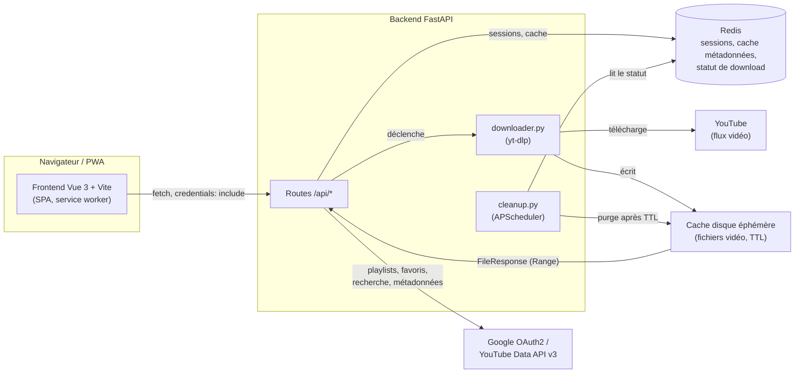
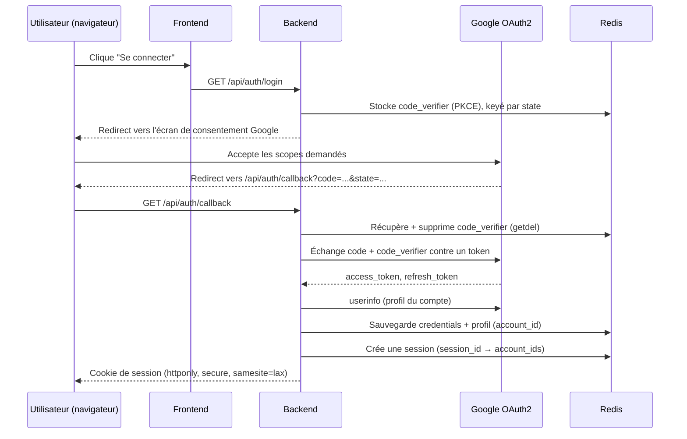
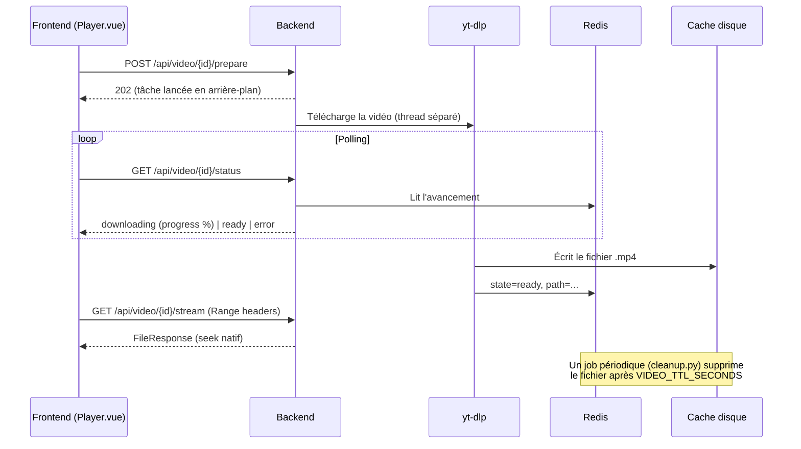

# OuyouyouTube

[](https://github.com/wardensfx/OuyouyouTube/actions/workflows/ci.yml)
[](LICENSE)

Client YouTube personnel : une PWA qui reproduit le fonctionnement de l'app
officielle (playlists, favoris, abonnements, recherche, accueil) mais dont le
visionnage est streamé depuis ton propre backend. Celui-ci télécharge la
vidéo via [yt-dlp](https://github.com/yt-dlp/yt-dlp), la sert avec support du
seek, puis la supprime automatiquement après un délai configurable. **Aucune
vidéo n'est stockée durablement.**

## ⚠️ Avertissement légal

Ce projet est un outil **d'usage strictement personnel**, pensé pour
consulter *ton propre* compte YouTube (playlists, abonnements, favoris) via
l'API officielle. Le téléchargement de flux vidéo passe par yt-dlp, qui
contourne les protections de diffusion de YouTube — c'est un usage qui peut
enfreindre les [conditions d'utilisation de YouTube](https://www.youtube.com/t/terms)
selon la juridiction et l'usage qui en est fait.

- Aucune vidéo n'est stockée durablement : chaque fichier est supprimé après
  un délai court (30 min par défaut), aucune mise à disposition publique ou
  redistribution n'est prévue par l'architecture.
- Ce dépôt contient uniquement du code : aucun contenu protégé par le droit
  d'auteur n'est distribué ici.
- L'auteur et les contributeurs de ce projet ne peuvent être tenus
  responsables d'un usage qui violerait les conditions d'utilisation de
  YouTube ou la législation applicable. **À toi de vérifier que ton usage est
  conforme aux lois de ta juridiction avant de déployer et d'utiliser cet
  outil.**
- Ce projet n'est affilié à Google/YouTube d'aucune manière.

## Fonctionnalités

- Connexion Google OAuth2, **multi-comptes** (plusieurs comptes Google liés à
  une même session)
- Playlists : création, renommage, suppression, ajout/retrait de vidéos, tri
  personnalisable
- Favoris (vidéos likées), abonnements, tendances, recherche
- Pages chaîne, noms de chaîne cliquables partout
- Reprise de lecture automatique, statut vu/non-vu, historique de progression
- Thème glassmorphism dark, responsive, PWA installable (mobile/desktop),
  tiré-pour-rafraîchir sur mobile
- Raccourcis clavier façon YouTube dans le lecteur

Voir [`ROADMAP.md`](ROADMAP.md) pour le détail de ce qui est fait, en cours,
ou volontairement hors scope.

## Architecture



Principe directeur : **le moins de code custom possible**. Chaque
préoccupation transverse est déléguée à une lib standard plutôt que
réimplémentée :

| Besoin | Solution |
| --- | --- |
| Seek vidéo (`Range` headers) | `FileResponse` de Starlette — natif |
| OAuth2 Google | `google-auth-oauthlib` (lib officielle) |
| Nettoyage périodique des fichiers | `APScheduler` |
| Cache métadonnées / sessions | Redis |

## Comment ça marche

### Authentification (OAuth2 + PKCE)



Le cookie de session ne contient qu'un `session_id` opaque — les tokens
Google (access/refresh) restent en Redis, jamais côté client.

### Lecture d'une vidéo



## Stack

| Couche | Techno | Pourquoi |
| --- | --- | --- |
| Backend | [FastAPI](https://fastapi.tiangolo.com/) | Import direct de `yt_dlp` comme lib Python (pas de subprocess) |
| Extraction vidéo | [yt-dlp](https://github.com/yt-dlp/yt-dlp) | Le seul composant qui contourne les protections YouTube |
| Données YouTube | [YouTube Data API v3](https://developers.google.com/youtube/v3) via `google-api-python-client` | Playlists/favoris/métadonnées — jamais via yt-dlp |
| Auth | `google-auth-oauthlib` | OAuth2 + PKCE, lib officielle Google |
| Cache / sessions | [Redis](https://redis.io/) | Métadonnées (TTL 15 min), sessions, statut de download |
| Nettoyage fichiers | [APScheduler](https://apscheduler.readthedocs.io/) | Job périodique, purge après TTL |
| Frontend | [Vue 3](https://vuejs.org/) + [Vite](https://vitejs.dev/) | SPA réactive |
| State | [Pinia](https://pinia.vuejs.org/) | Store partagé (bibliothèque, progression, playlists) |
| Routing | [vue-router](https://router.vuejs.org/) | Navigation SPA |
| PWA | [vite-plugin-pwa](https://vite-pwa-org.netlify.app/) | Manifest + service worker, installable |
| Icônes | [lucide](https://lucide.dev/) | Jeu d'icônes de l'UI |
| Reverse proxy (prod) | [Caddy](https://caddyserver.com/) ou [Traefik](https://traefik.io/) | HTTPS automatique (Let's Encrypt) |

## Démarrage rapide

### Prérequis
- Python 3.11+
- Node 18+
- Redis (`redis-server`)
- Un projet Google Cloud avec l'API "YouTube Data API v3" activée et des
  identifiants OAuth 2.0 (type "Web application") — voir le mode opératoire
  détaillé ci-dessous.

### Configurer Google Cloud (une seule fois)

L'app a besoin de tes propres identifiants OAuth pour accéder à *ton* compte
YouTube. Ça se configure entièrement depuis la
[console Google Cloud](https://console.cloud.google.com/), gratuitement.

1. **Créer un projet** — sélecteur de projet en haut de la console → **Nouveau
   projet** → nom libre (ex. `ouyouyoutube`).
2. **Activer l'API YouTube Data v3** — menu **API et services →
   Bibliothèque** → cherche **YouTube Data API v3** → **Activer**.
3. **Configurer l'écran de consentement OAuth** — **API et services → Écran
   de consentement OAuth** :
   - Type utilisateur : **Externe** (un compte Gmail perso ne peut pas créer
     d'app "interne").
   - Renseigne un nom d'app, un email support et un email développeur.
   - Section **Scopes** : ajoute explicitement les 4 scopes utilisés par
     l'app (`server/app/auth.py`) :
     - `https://www.googleapis.com/auth/youtube`
     - `openid`
     - `https://www.googleapis.com/auth/userinfo.email`
     - `https://www.googleapis.com/auth/userinfo.profile`

     ⚠️ Un scope non déclaré ici explicitement est silencieusement retiré de
     la réponse du token par Google, sans erreur visible — voir
     `ROADMAP.md` (section "Contraintes connues").
   - Section **Utilisateurs test** : tant que l'app n'est pas publiée/validée
     par Google, seuls les comptes ajoutés ici peuvent se connecter — ajoute
     ta propre adresse Gmail.
4. **Créer les identifiants OAuth 2.0** — **API et services → Identifiants
   → Créer des identifiants → ID client OAuth** :
   - Type d'application : **Application Web**.
   - **URI de redirection autorisés** : doit correspondre *exactement* à
     `GOOGLE_REDIRECT_URI` dans `server/.env` (voir plus bas). En local avec
     les valeurs par défaut :
     ```
     http://localhost:8000/api/auth/callback
     ```
   - Valide, puis récupère le **Client ID** et le **Client Secret** affichés.
5. **Renseigner `server/.env`** (voir la section suivante pour le créer) :
   ```
   GOOGLE_CLIENT_ID=xxxxxxxxxx.apps.googleusercontent.com
   GOOGLE_CLIENT_SECRET=xxxxxxxxxx
   GOOGLE_REDIRECT_URI=http://localhost:8000/api/auth/callback
   ```

En déploiement (domaine réel derrière Caddy/Traefik), remplace l'URI de
redirection par `https://ton-domaine/api/auth/callback` — à la fois dans
Google Cloud Console **et** dans `GOOGLE_REDIRECT_URI`/`FRONTEND_ORIGIN`
(voir la section [Déploiement](#déploiement-prod)). Google refuse les
domaines `.local` (mDNS) : impossible de tester avec `http://xxx.local`, il
faut `localhost` ou un vrai domaine.

### Backend + Redis en container (recommandé, notamment sous Windows)

Redis n'a pas de build officiel Windows, et faire tourner le backend en
container évite d'avoir à gérer un venv Python à la main. `docker-compose.yml`
à la racine du repo lance Redis + backend, avec hot-reload :

```powershell
# Windows : Docker tourne dans une distro WSL (ex. Ubuntu)
wsl -d Ubuntu -- bash -c "cd /mnt/c/chemin/vers/OuyouyouTube && docker compose --profile dev up --watch"
```

```bash
# macOS/Linux avec Docker installé nativement
docker compose --profile dev up --watch
```

Le `--profile dev` est nécessaire : `backend` (dev) et `backend-prod` sont
deux services distincts profilés séparément, pour que le backend "dev"
(port 8000 publié, hot-reload) ne tourne jamais en même temps que le profil
`prod` (qui ne doit exposer que Caddy, voir plus bas).

`--watch` synchronise `server/app/` en live dans le container (les
changements de code déclenchent le reload d'uvicorn) et rebuild l'image
automatiquement si `requirements.txt` change. Le backend est exposé sur
`http://localhost:8000` comme en local classique.

Avant le premier lancement : `cp server/.env.example server/.env` et
renseigner `GOOGLE_CLIENT_ID` / `GOOGLE_CLIENT_SECRET`.

### Frontend (toujours en direct, hors container)

```bash
cd front
npm install
npm run dev
```

Ouvre http://localhost:5173 — le proxy Vite redirige tout ce qui est sous
`/api/*` vers le backend sur le port 8000 (toutes les routes API vivent sous
ce préfixe, justement pour ne jamais entrer en collision avec les routes du
front, ex. `/search` ou `/playlists/manage`).

### Backend en direct (sans Docker)

```bash
cd server
python3 -m venv .venv && source .venv/bin/activate   # Windows: python -m venv .venv puis .\.venv\Scripts\python.exe
pip install -r requirements.txt
cp .env.example .env   # renseigner GOOGLE_CLIENT_ID / SECRET
redis-server &          # ou le container Redis seul si pas de build natif (Windows)
uvicorn app.main:app --reload --port 8000
```

**Piège IPv4/IPv6 (Windows)** : sur certaines configs, `localhost` se résout
en priorité vers `::1` (IPv6). Si le backend n'écoute que sur `127.0.0.1`
(IPv4), le proxy Vite renvoie `502 Bad Gateway`. `front/vite.config.js`
pointe donc explicitement vers `http://127.0.0.1:8000` (pas `localhost`).

**OAuth en HTTP local** : `oauthlib` refuse par défaut l'échange de token
hors HTTPS. En dev, avec un `redirect_uri` en `http://localhost`, il faut
positionner `OAUTHLIB_INSECURE_TRANSPORT=1` dans l'environnement du backend
(déjà fait dans `docker-compose.yml` ; à définir toi-même si tu lances
uvicorn sans Docker). **Ne jamais faire ça en prod.**

**Scope OAuth élargi après coup** : `flow.authorization_url(..., include_granted_scopes="true")`
fait remonter, en plus des scopes demandés dans la requête en cours, tous
ceux déjà accordés à l'app par le passé (auth incrémentale Google — utile
pour ne pas re-demander le consentement à chaque élargissement de scope).
`oauthlib` traite par défaut tout écart avec ce qui a été demandé comme une
erreur, y compris un scope *en plus*. Nécessite `OAUTHLIB_RELAX_TOKEN_SCOPE=1`
dans l'environnement du backend (déjà fait dans `docker-compose.yml` et les
quadlets Podman) — contrairement à `OAUTHLIB_INSECURE_TRANSPORT`, celui-ci
est nécessaire aussi en prod, pas juste en dev.

## Tests

```bash
# Backend
cd server && source .venv/bin/activate
pip install -r requirements-dev.txt
pytest -v

# Frontend
cd front
npm run test
```

La CI (`.github/workflows/ci.yml`) lance les deux suites plus `npm run
build` sur chaque push/PR. Voir [`ROADMAP.md`](ROADMAP.md) pour le détail de
ce qui est couvert.

## Déploiement (prod)

Le service `frontend` de `docker-compose.yml` (profil `prod`) build la SPA et
la sert via **Caddy** (`front/Dockerfile`, `front/Caddyfile`), qui fait aussi
office de reverse proxy vers le backend pour tout ce qui est sous `/api/*`.
Un seul point d'entrée, HTTPS automatique (Let's Encrypt) si `SITE_ADDRESS`
est un vrai nom de domaine — `backend-prod` (aussi profil `prod`) ne publie
aucun port sur l'hôte, seul `frontend` est joignable depuis l'extérieur,
comme dans les quadlets Podman.

```bash
cp .env.example .env   # définir SITE_ADDRESS
docker compose --profile prod up -d --build
```

Caddy écoute sur 8080 (HTTP) / 8443 (HTTPS), publiés tels quels sur l'hôte.

- `SITE_ADDRESS=:8080` (défaut) → HTTP simple, pratique pour tester en local
  sans domaine (pas de TLS).
- `SITE_ADDRESS=ouyouyoutube.mondomaine.fr` → Caddy obtient un certificat
  Let's Encrypt automatiquement sur 8443 (DNS doit pointer vers l'hôte ;
  redirige les ports externes 80/443 vers 8080/8443 sur cette machine si
  besoin, ex. sur la box/le routeur).

Dans tous les cas, `server/.env` (`GOOGLE_REDIRECT_URI`, `FRONTEND_ORIGIN`)
doit être cohérent avec `SITE_ADDRESS` — et le `redirect_uri` déclaré dans
Google Cloud Console doit correspondre exactement. Google refuse les
domaines `.local` (mDNS) : impossible de tester le login OAuth via
`http://xxx.local`, il faut un vrai domaine (ou `localhost`).

### Alternative : Podman Quadlet (derrière Traefik + pod_utils existants)

`services/*.container` fournit un équivalent du `docker-compose.yml` (profil
prod) sous forme d'unités systemd Quadlet, harmonisé avec les autres services
du même hôte (réseau `server_gateway`, pod `pod_utils`, style des labels
Traefik) : aucun port n'est publié par ces containers, ils rejoignent
`pod_utils` et sont rattachés à `server_gateway` comme les autres apps. Le
frontend est protégé par le middleware `authentik` en plus du login Google ;
`backend` et `redis` restent internes (pas de label Traefik).

⚠️ `pod_utils` partage le namespace réseau entre tous ses membres : vérifie
qu'aucun autre service du pod n'utilise déjà les ports 6379 (redis), 8000
(backend), 8080/8443 (frontend) avant d'activer ces units.

À adapter si besoin :
- `EnvironmentFile=%h/ouyouyoutube/server.env` (backend) → copier `server/.env`
  à cet endroit sur l'hôte.
- Le domaine (`ouyouyoutube.d-yann.fr`) dans `ouyouyoutube_frontend.container`
  si tu changes de nom.

```bash
podman build -t ouyouyoutube_backend:latest ./server
podman build -t ouyouyoutube_frontend:latest ./front

mkdir -p ~/.config/containers/systemd
cp services/*.container ~/.config/containers/systemd/
systemctl --user daemon-reload
systemctl --user enable --now ouyouyoutube_redis.service ouyouyoutube_backend.service ouyouyoutube_frontend.service
```

## Notes

- yt-dlp est importé comme lib Python, pas en subprocess — plus simple à
  maintenir. Il reste isolé dans `server/app/downloader.py`, jamais appelé
  ailleurs dans le code.
- Le seek fonctionne nativement grâce à Starlette `FileResponse`, aucun code
  Range custom.
- Si YouTube throttle/bloque : exporter un `cookies.txt` (extension
  navigateur type "Get cookies.txt") et renseigner `YTDLP_COOKIES_FILE` dans
  `.env`.

## Contribuer

Les contributions sont bienvenues — voir [`CONTRIBUTING.md`](CONTRIBUTING.md)
pour le setup de dev, les conventions de branches/commits, et le processus
de PR. Ce projet suit le [Contributor Covenant](CODE_OF_CONDUCT.md).

Pour signaler une vulnérabilité de sécurité, voir [`SECURITY.md`](SECURITY.md)
plutôt que d'ouvrir une issue publique.

## Crédits

Ce projet s'appuie entièrement sur des bibliothèques open source. Un immense
merci à leurs auteurs et mainteneurs :

**Backend**
- [yt-dlp](https://github.com/yt-dlp/yt-dlp) (Unlicense) — extraction/téléchargement du flux vidéo
- [FastAPI](https://github.com/fastapi/fastapi) (MIT) — framework backend
- [Uvicorn](https://github.com/encode/uvicorn) (BSD-3-Clause) — serveur ASGI
- [google-api-python-client](https://github.com/googleapis/google-api-python-client) (Apache-2.0) — client YouTube Data API v3
- [google-auth-oauthlib](https://github.com/googleapis/google-auth-library-python-oauthlib) (Apache-2.0) — flow OAuth2 + PKCE
- [redis-py](https://github.com/redis/redis-py) (MIT) — client Redis async
- [APScheduler](https://github.com/agronholm/apscheduler) (MIT) — job périodique de nettoyage
- [Pydantic](https://github.com/pydantic/pydantic) / [pydantic-settings](https://github.com/pydantic/pydantic-settings) (MIT) — validation et configuration

**Frontend**
- [Vue.js](https://github.com/vuejs/core) (MIT) — framework UI
- [Vite](https://github.com/vitejs/vite) (MIT) — build tool
- [Pinia](https://github.com/vuejs/pinia) (MIT) — state management
- [vue-router](https://github.com/vuejs/router) (MIT) — routing SPA
- [vite-plugin-pwa](https://github.com/vite-pwa/vite-plugin-pwa) (MIT) — manifest + service worker
- [Lucide](https://github.com/lucide-icons/lucide) (ISC) — icônes
- [Vitest](https://github.com/vitest-dev/vitest) (MIT) — tests

**Infrastructure (déploiement)**
- [Redis](https://github.com/redis/redis) (RSALv2/SSPLv1 dual license selon version — voir le dépôt officiel)
- [Caddy](https://github.com/caddyserver/caddy) (Apache-2.0) — reverse proxy, HTTPS automatique
- [Traefik](https://github.com/traefik/traefik) (MIT) — alternative reverse proxy (déploiement Podman Quadlet)

Ce projet lui-même n'est affilié à, ni endossé par, aucune des organisations
ci-dessus, ni par Google/YouTube.

## Licence

[MIT](LICENSE) — voir le fichier `LICENSE` pour le texte complet.
